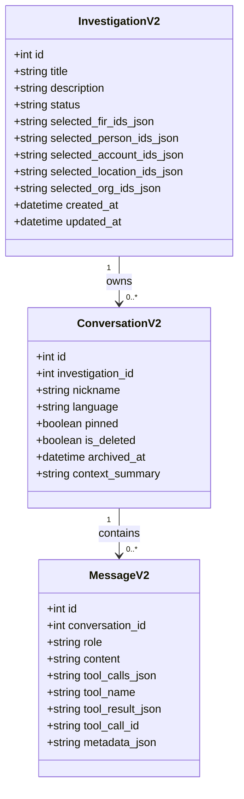

# Architecture v2 — Conversation Subsystem

This document outlines the architecture, data flows, and model relationships of SHERLOCK's rewritten Conversation Subsystem (v2).

## Core Principle

> **Conversation ≠ Investigation**

- **Investigation**: A user-curated workspace containing explicitly selected case records (FIRs, suspect profiles, bank accounts, locations, organizations). It contains no conversation history, messages, or chitchat.
- **Conversation**: A single chat thread containing a sequence of messages. Conversations can belong to an Investigation to inherit its context, but their identity is solely defined by their message logs.

---

## 1. Database Schema



---

## 2. LLM Orchestration Flow

The `LLMOrchestrator` governs all interactions between the user and the system, resolving pronouns, choosing tools, and formatting outputs natively.

```mermaid
sequenceflow
    User -> LLMOrchestrator: Send Message
    LLMOrchestrator -> Database: Load recent MessageV2 history
    LLMOrchestrator -> Database: Load active InvestigationV2 selected entities
    LLMOrchestrator -> LLM: completion(system_prompt + context, messages)
    alt LLM decides to answer directly
        LLM -> LLMOrchestrator: Text response
        LLMOrchestrator -> Database: Store MessageV2 (assistant)
        LLMOrchestrator -> User: Return reply
    else LLM decides to call tools
        LLM -> LLMOrchestrator: ToolCall (e.g. search_person)
        LLMOrchestrator -> Database: Store MessageV2 (assistant/tool-call decision)
        LLMOrchestrator -> ToolRegistry: execute(tool_name, arguments)
        ToolRegistry -> LLMOrchestrator: Structured tool output
        LLMOrchestrator -> Database: Store MessageV2 (tool output)
        LLMOrchestrator -> LLM: format_findings(output)
        LLM -> LLMOrchestrator: Conversational text response
        LLMOrchestrator -> Database: Store MessageV2 (assistant final reply)
        LLMOrchestrator -> User: Return reply
    end
```

---

## 3. Declarative Tool Registry

All capabilities are registered within the `ToolRegistry` at start-time. When executing a tool call, a unified `ToolContext` containing the database session, active investigation ID, active conversation ID, and language is passed:

1. **`investigate`**: Runs the complete 20-agent LangGraph pipeline for complex searches.
2. **`search_person`**: Database query + profiling for a specific suspect name.
3. **`search_cases`**: List and search FIR records.
4. **`search_graph`**: Graph node search (persons, vehicles, weapons).
5. **`financial_analysis`**: Mule account tracing and transaction network profiling.
6. **`timeline`**: SUSPECT chronological event reconstruction.
7. **`forecast`**: Crime district hotspot mapping and gang prediction.
8. **`network_graph`**: Ego-network expansion BFS traversal.
9. **`generate_pdf`**: Conversational timeline PDF report generation.
